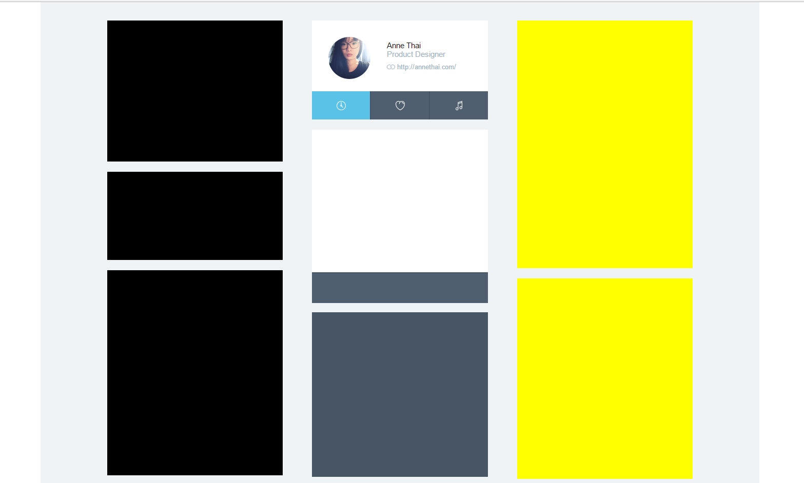

# nodejs

## 搭建与运行

### 第一部分：

#### 安装node
```apt-get install nodejs```
#### Express
```npm install -g express```
#### Jade
```npm install -g jade```

### 第二部分：

####   建立myapp工程
  * cd到要创建工程的目录：```cd: Develop\NodeJs```
  * 使用express创建工程：```express --sessions --css stylus myapp```
  * cd到myapp：```cd myapp```
  * 安装node_modules(这个过程有点慢)：```npm install```
  * 启动工程：```npm start```
  * 打开浏览器访问(默认端口是3000)：```http://localhost:3000```
#### 页面：
 

